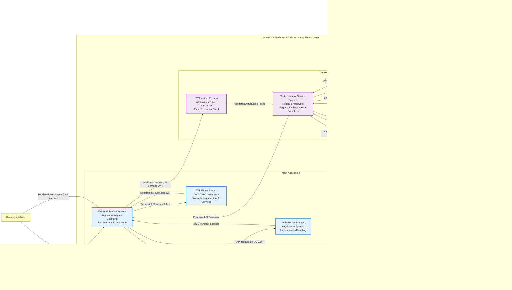

```mermaid
---
config:
  flowchart:
    nodeSpacing: 100
    rankSpacing: 100
    subGraphTitleMargin:
      top: 5
      bottom: 30
---
flowchart LR

    USER["Government User"] -- User Query / Chat Input --> FRONTEND_PROCESS
    subgraph subGraph0["Main Application"]
    direction TB
        FRONTEND_PROCESS["Frontend Service Process<br>React + AI Editor + CopilotKit<br>User Interface Components"]
        BACKEND_PROCESS["Backend API Process<br>Express Server<br>Business Logic &amp; Routing"]
        AUTH_PROCESS["Auth Router Process<br>Keycloak Integration<br>Authentication Handling"]
        JWT_PROCESS["JWT Router Process<br>JWT Token Generation<br>Token Management for AI Services"]
        CRUD_PROCESS["CRUD Operations Process<br>Database Interactions<br>Business Logic Layer"]
  end
 subgraph subGraph1["AI Services - NestJS Application"]
    direction TB
        AI_SERVICE_PROCESS["Marketplace AI Service Process<br>NestJS Framework<br>Request Orchestration + Cron Jobs"]
        VECTOR_SERVICE_PROCESS["Vector Service Process<br>ChromaDB Integration<br>RAG Processing"]
        JWT_VERIFY_PROCESS["JWT Verifier Process<br>AI Services Token Validation<br>30min Expiration Check"]
  end
 subgraph subGraph3["OpenShift Platform - BC Government Silver Cluster"]
    direction TB
        subGraph0
        subGraph1
        POSTGRES_STORE[("PostgreSQL Database<br>(User Sessions &amp; App Data)")]
        CHROMA_STORE[("ChromaDB Vector Store<br>(Document Embeddings)<br>")]
  end
 subgraph subGraph4["Azure Cloud Services"]
    direction TB
        APIMS_GATEWAY["Azure API Management<br>Service"]
        AI_FOUNDRY_SERVICE["Azure AI Foundry"]
  end
    FRONTEND_PROCESS -- Authentication Request --> BC_IDP["BC Government IDP<br>Keycloak/IDIR/GitHub"]
    BC_IDP -- BC Gov Token / Session --> AUTH_PROCESS
    AUTH_PROCESS -- BC Gov Auth Response --> FRONTEND_PROCESS
    FRONTEND_PROCESS -- Request AI Services Token --> JWT_PROCESS
    JWT_PROCESS -- Generated AI Services JWT --> FRONTEND_PROCESS
    FRONTEND_PROCESS -- AI Prompt request, AI Services JWT --> JWT_VERIFY_PROCESS
    JWT_VERIFY_PROCESS -- Validated AI Services Token --> AI_SERVICE_PROCESS
    FRONTEND_PROCESS -- API Requests / BC Gov Token --> BACKEND_PROCESS
    BACKEND_PROCESS -- CRUD Operations / Data Queries --> CRUD_PROCESS
    CRUD_PROCESS -- Database Queries / Data Updates --> POSTGRES_STORE
    POSTGRES_STORE -- Query Results / User Data --> CRUD_PROCESS
    AI_SERVICE_PROCESS -- Cron Job / Data Sync Query --> POSTGRES_STORE
    POSTGRES_STORE -- Document Data --> AI_SERVICE_PROCESS
    AI_SERVICE_PROCESS -- Sync PostgreSQL data --> CHROMA_STORE
    AI_SERVICE_PROCESS -- Context Search / Vector Similarity --> VECTOR_SERVICE_PROCESS
    VECTOR_SERVICE_PROCESS -- Vector Lookup --> CHROMA_STORE
    CHROMA_STORE -- Relevant Documents --> VECTOR_SERVICE_PROCESS
    VECTOR_SERVICE_PROCESS -- Retrieved Context --> AI_SERVICE_PROCESS
    AI_SERVICE_PROCESS -- "AI Prompts,<br style=--tw-scale-x:>API Key Auth" --> APIMS_GATEWAY
    APIMS_GATEWAY -- Forwarded Request / API Key --> AI_FOUNDRY_SERVICE
    AI_FOUNDRY_SERVICE -- AI Response --> APIMS_GATEWAY
    APIMS_GATEWAY -- AI model response data --> AI_SERVICE_PROCESS
    AI_SERVICE_PROCESS -- Processed AI Response --> FRONTEND_PROCESS
    FRONTEND_PROCESS -- Rendered Response / Chat Interface --> USER
     FRONTEND_PROCESS:::mainApp
     BACKEND_PROCESS:::mainApp
     AUTH_PROCESS:::mainApp
     JWT_PROCESS:::mainApp
     CRUD_PROCESS:::mainApp
     AI_SERVICE_PROCESS:::aiServices
     VECTOR_SERVICE_PROCESS:::aiServices
     JWT_VERIFY_PROCESS:::aiServices
     POSTGRES_STORE:::dataStore
     CHROMA_STORE:::vectorStore
     APIMS_GATEWAY:::azure
     AI_FOUNDRY_SERVICE:::azure
     USER:::userEntity
     BC_IDP:::idpService
    classDef userEntity fill:#fff9c4,stroke:#f9a825,stroke-width:2px
    classDef idpService fill:#ffe0b2,stroke:#ff8f00,stroke-width:2px
    classDef mainApp fill:#e3f2fd,stroke:#1976d2,stroke-width:2px
    classDef aiServices fill:#f3e5f5,stroke:#7b1fa2,stroke-width:2px
    classDef dataStore fill:#fff3e0,stroke:#f57c00,stroke-width:2px
    classDef vectorStore fill:#f1f8e9,stroke:#689f38,stroke-width:2px
    classDef azure fill:#e8f5e8,stroke:#388e3c,stroke-width:2px
```
